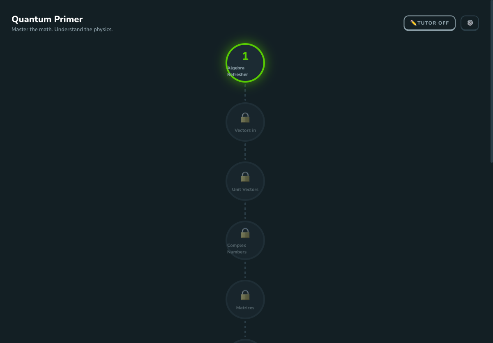

# Quantum Primer

A Duolingo-style quantum computing learning app built for iPad with Apple Pencil support. Takes students from basic algebra through quantum circuits with interactive lessons, practice problems, and quizzes.

## Curriculum

### Phase 1 — Math Foundations
| Ch | Title | Topics |
|----|-------|--------|
| 1 | Algebra Refresher | Linear equations, substitution, square roots, exponents |
| 2 | Vectors in 2D | Vector addition, scalar multiplication, magnitude |
| 3 | Unit Vectors | Normalization, unit vector checks, quantum probability |
| 4 | Complex Numbers | Addition, multiplication, conjugate, magnitude |
| 5 | Matrices | Matrix-vector multiply, matrix-matrix multiply, identity |

### Phase 2 — Quantum Computing
| Ch | Title | Topics |
|----|-------|--------|
| 6 | Dirac Notation | Bra-ket formalism, inner products, orthogonality, probability |
| 7 | Quantum Gates | Pauli X/Z, Hadamard, gate-then-measure, gate composition |
| 8 | Measurement | Born rule (complex amplitudes), valid states, expected counts, missing amplitude |
| 9 | Tensor Products | Two-qubit basis, tensor products, joint states, separability |
| 10 | Entanglement | CNOT gate, Bell states, entangled measurement |
| 11 | Quantum Circuits | Circuit tracing (1- and 2-qubit), output probabilities, equivalence |

## Features

- **52 lesson steps** across 11 chapters, each with a worked example before the practice problem
- **41 problem generators** with deterministic grading (no AI required)
- **"Why This Matters"** — every problem shows a plain-English explanation of what you just computed and why it matters in quantum computing
- **Ask Tutor** — AI chat powered by Claude, available before, during, and after answering. Gives hints while you work (without spoiling the answer) and explains concepts after you answer
- **Worked solutions** shown on incorrect answers with step-by-step breakdowns
- **Apple Pencil notepad** for working out problems by hand, with palm rejection
- **Optional AI work review** — vision-based feedback on handwritten work via Claude API
- **Progress tracking** — localStorage persistence, sequential chapter unlocking
- **Quiz gates** — pass the quiz to unlock the next chapter

## Running

```bash
pip install fastapi uvicorn anthropic python-dotenv
python app.py          # serves at http://0.0.0.0:8000
```

The app is fully functional without an API key. Set `ANTHROPIC_API_KEY` in `.env` to enable the Ask Tutor chat and AI work review features.

## Architecture

- `app.py` — FastAPI server with three API endpoints:
  - `/api/ask` — AI tutor chat (context-aware Q&A powered by Claude Sonnet)
  - `/api/read-answer` — OCR for handwritten answers via vision
  - `/api/review-work` — AI feedback on handwritten work via vision
- `static/app.js` — SPA router, state machine, all screen renderers
- `static/problems.js` — 41 problem generators + answer checker (numeric, vector, vector4, complex, matrix, yesno)
- `static/chapters.js` — 11 chapters of curriculum with lesson HTML, worked examples, and "Why This Matters" context
- `static/canvas.js` — Apple Pencil drawing engine with palm rejection and stroke tracking
- `static/style.css` — Duolingo-inspired dark theme design system

All grading runs in the browser. The server handles static files and the optional AI endpoints.

## Tech Stack

- **Frontend:** Vanilla JS (ES modules), HTML5 Canvas
- **Backend:** Python, FastAPI
- **AI (optional):** Anthropic Claude API (Sonnet) for tutoring chat and vision-based work review
- **Target device:** iPad with Apple Pencil (also works on desktop)

## Screenshot


