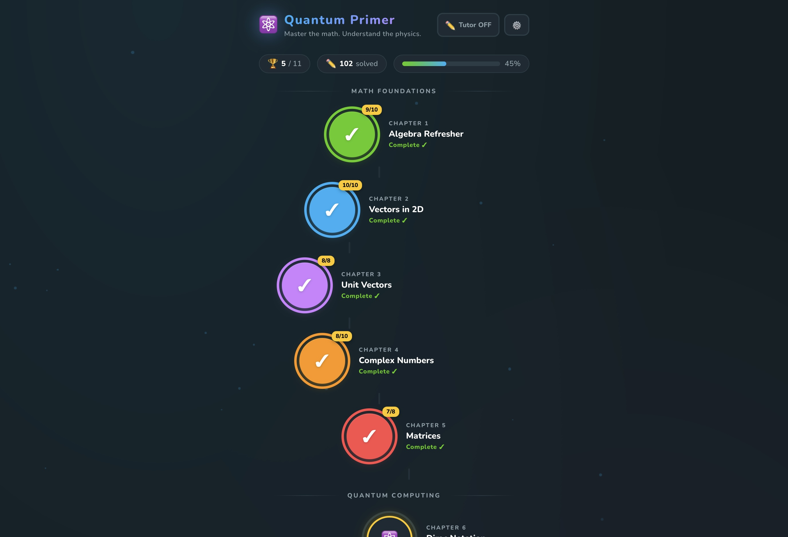
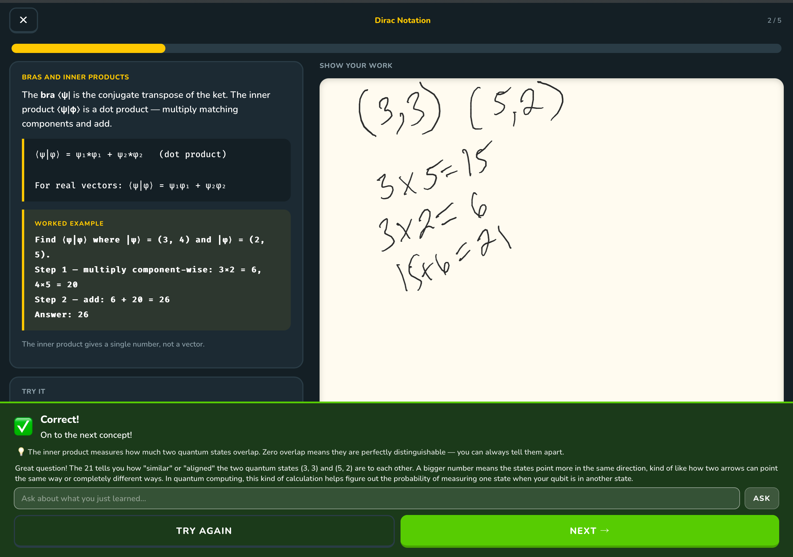

# Quantum Primer

A Duolingo-style quantum computing learning app built for iPad with Apple Pencil support. Takes students from basic algebra through quantum circuits with interactive lessons, practice problems, and quizzes.

## Curriculum

### Phase 1 — Math Foundations
| Ch | Title | Topics |
|----|-------|--------|
| 1 | Algebra Refresher | Linear equations, substitution, square roots, exponents |
| 2 | Vectors in 2D | Vector addition, scalar multiplication, magnitude |
| 3 | Unit Vectors | Normalization, unit vector checks, quantum probability |
| 4 | Complex Numbers | Addition, multiplication, conjugate, magnitude |
| 5 | Matrices | Matrix-vector multiply, matrix-matrix multiply, identity |

### Phase 2 — Quantum Computing
| Ch | Title | Topics |
|----|-------|--------|
| 6 | Dirac Notation | Bra-ket formalism, inner products, orthogonality, probability |
| 7 | Quantum Gates | Pauli X/Z, Hadamard, gate-then-measure, gate composition |
| 8 | Measurement | Born rule (complex amplitudes), valid states, expected counts, missing amplitude |
| 9 | Tensor Products | Two-qubit basis, tensor products, joint states, decomposition, measurement probabilities, separability |
| 10 | Entanglement | CNOT gate, Bell states, entangled measurement |
| 11 | Quantum Circuits | Circuit tracing (1- and 2-qubit), output probabilities, equivalence |

## Features

- **192 sub-problems** across 51 lesson steps in 11 chapters
- **Dynamic teaching units** — teaching text, worked examples, and practice problems advance together in lockstep per sub-problem. The worked example always matches the type of problem being asked, with different numbers so students can't copy answers. All 43 problem types fully migrated to dynamic templates.
- **43 problem generators** with structural variations (negatives, edge cases, extended operations) and deterministic grading (no AI required)
- **Anti-frustration system** — after 2 wrong attempts on the same variation, the worked solution appears inline so students don't get stuck
- **"Why This Matters"** — every problem shows a plain-English explanation of what you just computed and why it matters in quantum computing
- **Ask Tutor** — AI chat powered by Claude, available before, during, and after answering. Gives hints while you work (without spoiling the answer) and explains concepts after you answer
- **Worked solutions** shown on incorrect answers with step-by-step breakdowns
- **Apple Pencil notepad** for working out problems by hand, with palm rejection
- **Optional AI work review** — vision-based feedback on handwritten work via Claude API
- **Progress tracking** — localStorage persistence, sequential chapter unlocking, lesson progress resume
- **Quiz gates** — pass the quiz to unlock the next chapter

## Running

```bash
pip install fastapi uvicorn anthropic python-dotenv
python app.py          # serves at http://0.0.0.0:8000
```

The app is fully functional without an API key. Set `ANTHROPIC_API_KEY` in `.env` to enable the Ask Tutor chat and AI work review features.

## Architecture

- `app.py` — FastAPI server with three API endpoints:
  - `/api/ask` — AI tutor chat (context-aware Q&A powered by Claude Sonnet)
  - `/api/read-answer` — OCR for handwritten answers via vision
  - `/api/review-work` — AI feedback on handwritten work via vision
- `static/app.js` — SPA router, state machine, all screen renderers, sub-problem progression loop
- `static/templates.js` — Dynamic teaching unit templates that generate teaching text + worked examples + practice problems together per variation
- `static/problems.js` — 43 problem generators with variation support + answer checker (numeric, vector, vector4, complex, matrix, yesno)
- `static/chapters.js` — 11 chapters of curriculum with progression arrays and lesson structure
- `static/canvas.js` — Apple Pencil drawing engine with palm rejection and stroke tracking
- `static/style.css` — Duolingo-inspired dark theme design system

All grading runs in the browser. The server handles static files and the optional AI endpoints.

### Dynamic Teaching Unit System

Teaching content is generated programmatically from templates defined per problem type. Each template produces a complete teaching unit for a given difficulty/variation:

```js
TEMPLATES[problemType].generate(difficulty, variation)
// Returns: { teachingText, workedExample: { problem, steps, insight }, tryIt: { question, answer, ... } }
```

The worked example and practice problem are structurally identical but use different random numbers. When a student retries, the entire left panel re-renders with fresh numbers for both the example and the problem. All 43 problem types have been migrated to dynamic templates.

### Lesson Progression System

Each lesson step defines a `progression` array of 3-5 sub-problems that escalate in difficulty:

```js
progression: [
  { difficulty: 1, variation: 'basic' },        // mirrors the worked example
  { difficulty: 1, variation: 'with_negatives' }, // introduces negative values
  { difficulty: 2, variation: 'edge_case' },      // zero components, purely real, etc.
  { difficulty: 2, variation: 'extended' },        // more operands or combined operations
]
```

The `variation` parameter controls problem **structure** (negatives, pure-real terms, three operands), while `difficulty` controls **number ranges**. Students must complete all sub-problems in a step before advancing to the next concept.

## Tech Stack

- **Frontend:** Vanilla JS (ES modules), HTML5 Canvas
- **Backend:** Python, FastAPI
- **AI (optional):** Anthropic Claude API (Sonnet) for tutoring chat and vision-based work review
- **Target device:** iPad with Apple Pencil (also works on desktop)

## Screenshots

| Home Screen | Lesson + Notepad |
|:-----------:|:----------------:|
|  |  |
